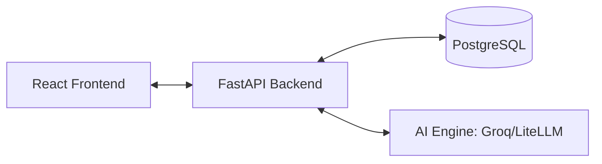

# NexusMG: The Digital Hub - Project Overview

## 🌟 Vision
NexusMG is a comprehensive developer readiness platform designed to bridge the gap between education and employment. By leveraging cutting-edge AI, it provides developers with objective, data-driven insights into their professional presence and technical skills.

---

## 💎 Key Features
- **LinkedIn Audit**: Automated and manual review of professional profiles with actionable feedback.
- **GitHub Analysis**: Deep-dive into repository quality, commit patterns, and project complexity.
- **CV Evaluation**: AI-powered resume parsing and optimization suggestions.
- **Readiness Scoring**: A consolidated index (0-100) representing a developer's market readiness.
- **Instructor Dashboard**: Tools for mentors to track cohort progress and identify students needing support.

---

## 🏗 System Architecture
NexusMG uses a decoupled **MERN-like** architecture but with a Python/FastAPI backend for superior AI integration:



---

## 🛠 Project Standards
### Code Quality
- **Prettier & ESLint**: Strict linting rules for frontend consistency.
- **Type Safety**: TypeScript on the frontend; Pydantic on the backend.
- **DRY Principle**: Shared logic extracted into services and custom hooks.

### Deployment Readiness
- **Environment Variables**: Managed via `.env` files for security.
- **Database Migrations**: Versioned database schema via Alembic.
- **API Documentation**: Automated OpenAPI specifications.

---

## 👥 Roles & Permissions
- **Trainee**: Access to self-evaluation tools, progress tracking, and AI feedback.
- **Instructor**: Access to trainee analytics, group performance, and reporting.
- **Admin**: Full system configuration and user management.

---

## 🛤 Roadmap
- [x] Core AI Evaluation Engines
- [x] Multi-role Dashboard System
- [x] Premium Dark Mode UI
- [ ] Portfolio Auto-Generator
- [ ] Integration with Job Boards
- [ ] Real-time Collaboration Tools
```
